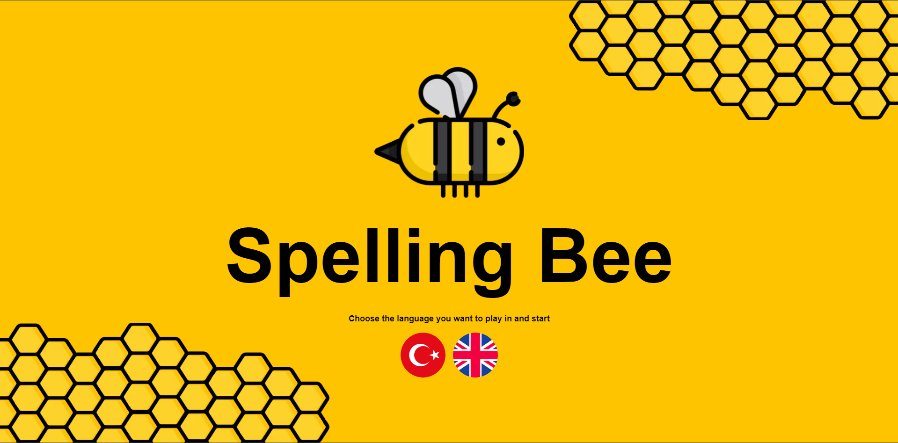
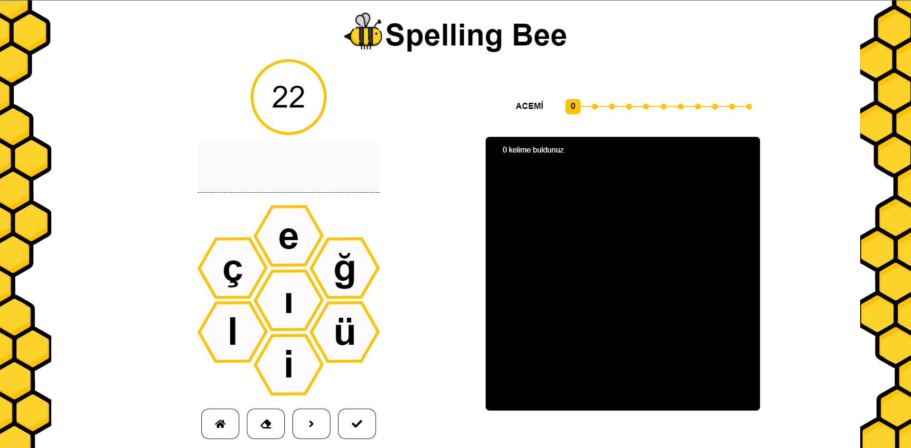
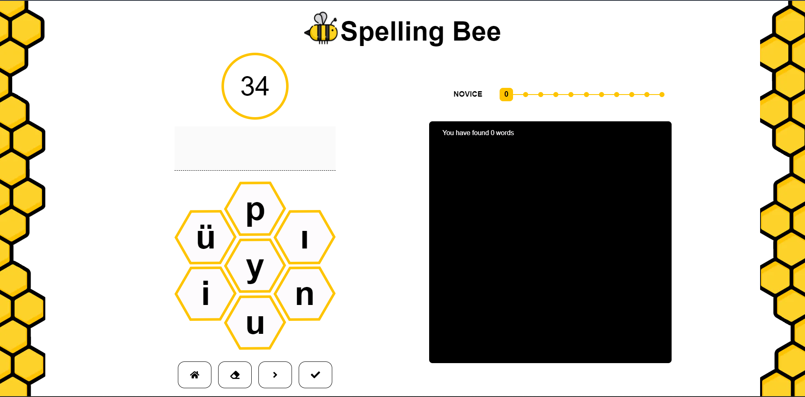
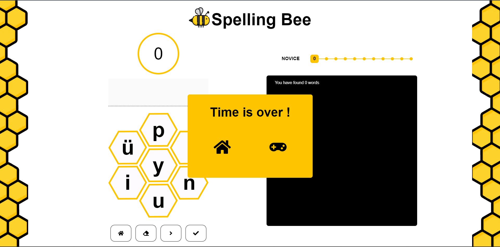
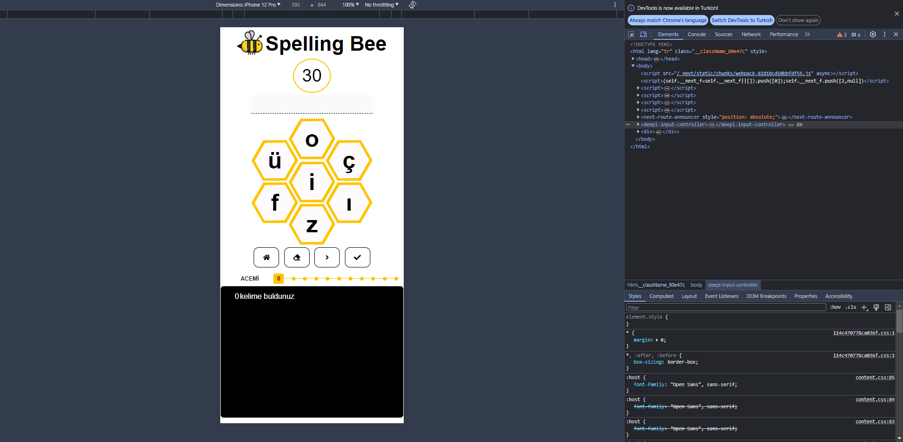

🚀 Next ve Typescript ile geliştirdiğim Spelling Bee oyununun lansmanını heyecanla duyuruyorum! 🎉 
🔗 Uygulamayı görmek ve denemek için [buraya tıklayabilirsiniz](https://spelling-bee-app-nine.vercel.app/). 
💅 Figmadaki tasarımımı görmek için [buraya tıklayabilirsiniz](https://www.figma.com/design/lWPws1f6aFJeqv1ODKfgcx/spelling-bee?m=dev&node-id=0%3A1&t=XN7GMOdUyQVOPJ18-1). 
📚 Bu oyun, kullanıcıların verilen yedi adet harf ile kelime türetmesini, her türettiği kalimenin harfi kadar puan almasını, eğer harfleri üçten fazla ise ilave 3 puan daha almasını sağlıyor. Oyuna 60sn ile başlıyor. Her doğru oluşturduğu kelimede +15sn kazanıyor, her yeni harf grubu ürettiğinde -5sn kaybediyor 
🔍 Backend tarafında next/server kullandım 
🔄 Seçilen dile göre oyun sayfası dinamik olarak oluşuyor. 
💼 Seçilen dil seçeneğine göre sayfa içeriğinin alınması, random harf grubunun üretilmesi, yazılan kelimenin kontrolü backend te yapılıyor 
👨‍💻 Bu projeyi paylaşmaktan heyecan duyuyorum ve geri bildiriminizi bekliyorum! 

